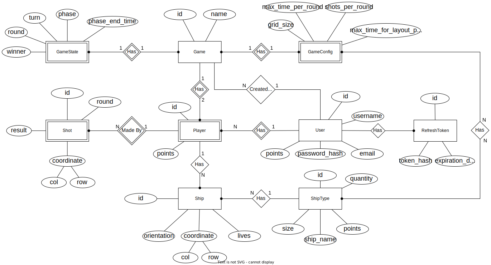

# Battleships - Documentation

## Introduction

> This document contains the relevant design and implementation aspects of DAW project.

The project development is divided into 2 phases. The main objective of each phase is described below:

* **Phase 1**: Development of the Web API for the Battleships game - **backend**;
* **Phase 2**: Development of the Web UI for the Battleships game - **frontend**.

## Authors

- 48089 [André Páscoa](https://github.com/devandrepascoa)
- 48280 [André Jesus](https://github.com/andre-j3sus)
- 48287 [Nyckollas Brandão](https://github.com/Nyckoka)

Professor: Eng. Pedro Félix

@ISEL 
Bachelor in Computer Science and Computer Engineering 
Web Application Development - LEIC51D - Group 03 
Winter Semester of 2022/2023

## Table of Contents

* [Introduction](#introduction);
* [Authors](#authors);
* [Table of Contents](#table-of-contents);
* [Modeling the Database](#modeling-the-database):
    * [Conceptual Model](#conceptual-model);
    * [Physical Model](#physical-model),
* [Software Organization](#software-organization):
    * [Project structure](#project-structure);
    * [Project dependencies](#project-dependencies);
    * [Open-API Specification](#open-api-specification);
    * [Use-Case Scenario](#use-case-scenario);
    * [Connection Management](#connection-management);
    * [Data Access](#data-access);
    * [Error Handling](#error-handling);
    * [Testing](#testing);
* [Conclusions](#conclusions);
    * [Critical Evaluation](#critical-evaluation).

---

## Modeling the Database

### Conceptual Model

The following diagram holds the Entity-Relationship model for the information managed by the system.

    

The conceptual model is stored in the [`docs/battleships-db`](./battleships-db) folder.

We highlight the following aspects:

* ...

The conceptual model has the following restrictions:

* ...

### Physical Model

The physical model of the database is available in [createSchema.sql](../code/jvm/src/main/sql/createSchema.sql).

To implement and manage the database **PostgreSQL** was used.

The [`src/main/sql`](../code/jvm/src/main/sql) folder contains all SQL scripts developed:

* [createSchema.sql](../code/jvm/src/main/sql/createSchema.sql) - creates the database schema;
* [cleanData.sql](../code/jvm/src/main/sql/cleanData.sql) - clears the database tables;
* [insertData.sql](../code/jvm/src/main/sql/insertData.sql) - adds data to the database.

We highlight the following aspects of this model:

* All unique identifiers are `SERIAL`;
* ...

---

## Software Organization

### Project Structure

The project is organized as follows:

* ...

---

### Project Dependencies

...

---

### Open-API Specification

The Open-API Specification is available [here](battleships-api-spec.yaml).

In our Open-API specification, we highlight the following aspects:

* The requests are split into 3 routers: ...;
* ...

---

### Use-Case Scenario

...

---

### Connection Management

...

---

### Data Access

The data access implementation is available [here](../code/jvm/src/main/kotlin/pt/isel/daw/battleships/database).

...

---

### Error Handling

For error handling purposes, ...

---

### Testing

...

---
---

## Conclusions

### Critical Evaluation

...
