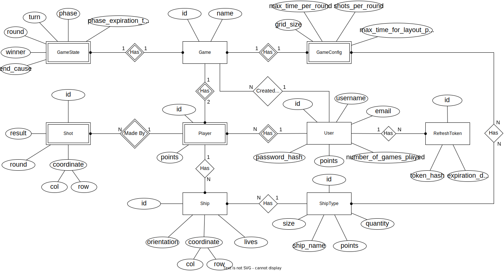
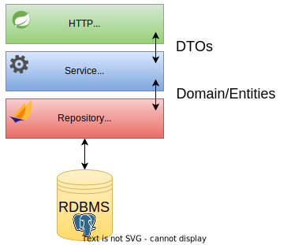

# Battleships - Documentation

## Introduction

> This document contains the relevant design and implementation aspects of DAW project.

The project development is divided into 2 phases. The main objective of each phase is described below:

* **Phase 1**: Development of the Web API for the Battleships game - **backend**;
* **Phase 2**: Development of the Web UI for the Battleships game - **frontend**.

## Authors

- 48089 [André Páscoa](https://github.com/devandrepascoa)
- 48280 [André Jesus](https://github.com/andre-j3sus)
- 48287 [Nyckollas Brandão](https://github.com/Nyckoka)

Professor: Eng. Pedro Félix

@ISEL 
Bachelor in Computer Science and Computer Engineering 
Web Application Development - LEIC51D - Group 03 
Winter Semester of 2022/2023

## Table of Contents

* [Introduction](#introduction);
* [Authors](#authors);
* [Table of Contents](#table-of-contents);
* [Project Structure](#project-structure);
* [Modeling the Database](#modeling-the-database):
    * [Conceptual Model](#conceptual-model);
    * [Physical Model](#physical-model);
* [Application Architecture](#application-architecture):
    * [Open-API Specification](#open-api-specification);
    * [Presentation Layer](#presentation-layer);
    * [Business Logic Layer](#business-logic-layer);
    * [Data Access Layer](#data-access-layer);
    * [Data Representation](#data-representation);
    * [Authentication](#authentication);
    * [Error Handling](#error-handling);
    * [Use-Case Scenario](#use-case-scenario);
    * [Running the Application](#running-the-application);
    * [Testing the Application](#testing-the-application);
* [Conclusions - Critical Evaluatio](#conclusions---critical-evaluation);

---
---

## Project Structure

The project is organized as follows:

* [`code`](../code) - contains the source code of the project;
    * [`/js`](../code/js) - contains the JS gradle project, in JavaScript (for phase 2);
    * [`/jvm`](../code/jvm) - contains the JVM gradle project, in Kotlin;
        * [`/src/main/kotlin`](../code/jvm/src/main/kotlin) - contains the source code of the project;
        * [`/src/test/kotlin`](../code/jvm/src/test/kotlin) - contains the tests of the project;
    * [`/sql`](../code/sql) - contains the SQL scripts used to create and manage the database;
* [`docs`](../docs) - contains the documentation of the project.

The JVM application is a simple Spring Boot application, built with Spring Initializr.
Some used dependencies are:

* **Spring Web** - for the REST API;
* **Spring Data JPA** - for the database access, using PostgreSQL;
* **JSON Web Token** - for the authentication.

To read more about the JVM application structure, see the [Application Architecture](#application-architecture)
section.

---
---

## Modeling the Database

### Conceptual Model

The following diagram holds the Entity-Relationship model for the information managed by the system.

<!--suppress ALL -->

    

The conceptual model is stored in the [`docs/battleships-db`](./diagrams/battleships-diagrams-er-diagram.svg) folder.

We highlight the following aspects:

* A `Player` is a weak entity of the `User`and `Game` entities, since a player can be only assigned to a user and
  a game;
* The `GameState` and `GameConfig` entities have a weak connection through the `Game` entity, since it is a `1:1`
  relationship in both cases;
* All entities are identified through an attribute `id`which will be used as primary key in every table;
* The `coordinate` attribute is a complex value comprised of `col` and `row` sub-attributes;
* The `Game` entity has a 1:2 relationship with the `Player` entity, so one game can host up to two players;
* The `User` entity has a `points` attribute that will be used to store the points of the user in the ranking; this
  attribute should not be mistaken with the `points` attribute of the `Player` entity, which is used to store the points
  in the current game;
* The `GameConfig` entity has a relationship with the `ShipType` entity, so that the types of ships that can be used in
  the game are defined by the game creator.

The conceptual model has the following restrictions:

* `User` entity:
    * The `username` and `email` attributes should be unique;
    * The `username` attribute length should be between 3 and 40 characters;
    * The `email` attribute needs to follow the following pattern: `^[A-Za-z0-9+_.-]+@(.+)$`;
    * The `points` attrinbute (also present in the `Player` entity) should not have negative values;

* `Game`, `GameState` and `GameConfig` entities:
    * The `name` attribute should have a length between 1 and 40 characters;
    * The `phase` attribute only accepts the following values: `WAITING_FOR_PLAYERS`, `GRID_LAYOUT`, `IN_PROGRESS`
      , `FINISHED`;
    * The `grid_size` attribute should be between 7 and 18;
    * The `max_time_for_layout_phase` should be between 10 and 120 seconds;
    * The `max_time_per_round` should be between 50 and 120 seconds;
    * The `shots_per_round` should be between 1 and 5;
    * The `round` attribute (also present in the `Shot` entity) should be greater than 0;

* `Ship` and `ShipType` entities:
    * The `ship_name` attribute should have a length between 1 and 40 characters;
    * The `quantity` attribute should be between 0 and 10;
    * The `size` attribute should be between 1 and 7;
    * The `points` attribute should be between 1 and 100;
    * The `orientation` attribute only accepts the following values: `VERTICAL`, `HORIZONTAL`:
    * The `lives` attribute should be between 0 and 7;

* The `col` attribute should be a character between `A` and `R`;
* The `row` attribute should be between 1 and 18;
* The `result` attribute of the `Shot` entity only accepts the following values: `HIT`, `MISS`, `SUNK`.

---

### Physical Model

The physical model of the database is available in [createSchema.sql](../code/sql/createSchema.sql).

To implement and manage the database **PostgreSQL** was used.

The [`code/sql`](../code/sql) folder contains all SQL scripts developed:

* [createSchema.sql](../code/sql/createSchema.sql) - creates the database schema;
* [cleanData.sql](../code/sql/cleanData.sql) - clears the database tables;
* [insertData.sql](../code/sql/insertData.sql) - adds data to the database.

We highlight the following aspects of this model:

* All primary keys are represented by the `id` attribute and are `SERIAL`;
* Other attributes that are not primary keys, but also identify the entity are `UNIQUE`;
* All the restrictions described in the [Conceptual Model](#conceptual-model) chapter are reflected in the physical
  model, using `check constraints`.

---
---

## Application Architecture

    

The JVM application is organized as follows:

* [`/domain`](../code/jvm/src/main/kotlin/pt/isel/daw/battleships/domain) - contains the domain classes
  of the application, implemented using **Spring Data JPA**;
* [`/http`](../code/jvm/src/main/kotlin/pt/isel/daw/battleships/http) - contains the HTTP layer of the application,
  implemented using **Spring Web MVC**;
* [`/repository`](../code/jvm/src/main/kotlin/pt/isel/daw/battleships/repository) - contains the repository layer of
  the application, implemented using **Spring Data JPA**;
* [`/service`](../code/jvm/src/main/kotlin/pt/isel/daw/battleships/service) - contains the services that manage the
  business logic of the application;
* [`/utils`](../code/jvm/src/main/kotlin/pt/isel/daw/battleships/utils) - contains utility classes used by the
  application;
* [`BattleshipsApplication.kt`](../code/jvm/src/main/kotlin/pt/isel/daw/battleships/BattleshipsApplication.kt) -
  contains the entry point of the application.

### [Open-API Specification](battleships-api-spec.yaml)

In our Open-API specification, we highlight the following aspects:

* The requests are split into four groups:
    * `Home` - contains the request to get the API's home page;
    * `User` - requests related to the `User` entity;
    * `Game` - requests related to the `Game` entity;
    * `Player` - requests related to the `Player` entity, which is a weak entity of the `Game` and `User` entities;
* All the `GET` requests are don´t need authentication, except for the ones in the `Player` group, since they are
  related to a specific player;
* All the `POST` requests (except for the user creation request) need authentication, using the `Authorization` header
  with the `Bearer` scheme;
* The `Content-Type` header in all the responses is `application/vnd.siren+json`, since we are using
  the [Siren](https://github.com/kevinswiber/siren) hypermedia format.

---

### [Presentation Layer](../code/jvm/src/main/kotlin/pt/isel/daw/battleships/http)

The presentation layer is responsible for receiving the requests from the client, processing them, sending them to the
service layer and returning the responses to the client.
The **data representation** used in these requests and responses are **DTOs (Data Transfer Objects)**.

This layer is implemented using **Spring Web MVC**.

The presentation layer is organized as follows:

* [`/controllers`](../code/jvm/src/main/kotlin/pt/isel/daw/battleships/http/controllers) - contains the controllers
  that manage the HTTP requests;
* [`/pipeline`](../code/jvm/src/main/kotlin/pt/isel/daw/battleships/http/pipeline) - contains the pipeline that
  process the HTTP requests;
* [`/siren`](../code/jvm/src/main/kotlin/pt/isel/daw/battleships/http/siren) - contains the classes that implement the
  [Siren](https://github.com/kevinswiber/siren) hypermedia format.

The [`Uris`](../code/jvm/src/main/kotlin/pt/isel/daw/battleships/http/Uris.kt) object contains the URIs of the
application used by the controllers.

---

### [Business Logic Layer](../code/jvm/src/main/kotlin/pt/isel/daw/battleships/service)

The service layer is responsible for managing the business logic of the application, receiving the requests from the
presentation layer, processing them, sending them to the data access layer and returning the responses to the
presentation layer.
The **data representation** used in these requests and responses are **DTOs (Data Transfer Objects)**.

Each service is responsible for managing a specific group of requests, and each service is implemented as a
`@Service` class, which is injected into the controller that manages the requests.

Each service has an interface that defines the methods that it implements, and the implementation of the interface.
The services are the following:

* `UsersService` - manages the requests related to the `User` entity;
* `GamesService` - manages the requests related to the `Game` entity;
* `PlayersService` - manages the requests related to the `Player` entity.

To authenticate a user inside a service, we implemented the `AuthenticatedService` abstract class, which has a method
that returns the authenticated user, given a token. This class is extended by the `GamesService` and `PlayersService`.

---

### [Data Access Layer](../code/jvm/src/main/kotlin/pt/isel/daw/battleships/repository)

The data access layer is implemented using **Spring Data JPA**.

This layer is responsible for managing the data access of the application, receiving the requests from the service
layer, processing them, sending them to the database and returning the responses to the service layer.
The **data representation** used in these requests and responses is the **domain classes**, which are implemented
using **Spring Data JPA**.

---

### Data Representation

There are three types of data representation in the application:

* **Models**;
* **DTOs (Data Trasfer Objects)**;
* **Entities/Domain Classes**.

The **models** are used in the **presentation layer** to represent the request and response bodies. This representation
is used to validate the request and response bodies, and to convert them to the **DTOs**, which are used in the
**service layer**. The validation is done using [**Jakaarta Bean Validation**](https://beanvalidation.org/).

The **DTOs** are the data representation used in the communication between the **presentation layer** and the
**service layer**. The DTOs are a "raw" representation of the data, and they are converted to the
**entities/domain classes**.

The **entities/domain classes** are the data representation used in the communication between the **service layer** and
the **data access layer**. The entities are implemented using 
[**Spring Data JPA**](https://spring.io/projects/spring-data-jpa#overview).

---

### Authentication

To perform some requests, like creating a game, the client needs to be authenticated. The authentication mechanism is
implemented using **JSON Web Tokens**. The authentication process is the following:

* Each user has an **Access Token** and one or more **Refresh Tokens**;
* The access token is used to authenticate the user in the application, and it expires after a short period of time,
  like an hour;
* The refresh token is used to generate a new access token, and it expires after a long period of time, like a day;
  these tokens are stored in the database;
* When the access token expires, the client sends a request to the `/user/refresh` endpoint, sending the refresh token
  in the body of the request; the server generates a new access token and returns it to the client in the response.

To authenticate a user inside a controller, we implemented
the [`@Authenticated`](../code/jvm/src/main/kotlin/pt/isel/daw/battleships/http/pipeline/authentication/Authenticated.kt)
annotation, which is used in controllers and handlers, indicating that the user must be authenticated to access the
resource.

The [`AuthenticationInterceptor`](../code/jvm/src/main/kotlin/pt/isel/daw/battleships/http/pipeline/authentication/AuthenticationInterceptor.kt)
class implements the `HandlerInterceptor` interface, and is responsible for intercepting the requests and checking if
the user is authenticated, if the `@Authenticated` annotation is present.
This class has an override of the `preHandle` method, which is called before the request is processed by the controller.

---

### Error Handling

To handle errors/exceptions, we implemented
the [`ErrorHandler`](../code/jvm/src/main/kotlin/pt/isel/daw/battleships/http/pipeline/ExceptionHandler.kt) class,
which is annotated with `@ControllerAdvice`, and is responsible for intercepting the exceptions and returning the
appropriate response, with the appropriate status code and message.

The service layer throws the specific exceptions that are handled by the `ErrorHandler` class, present in the
[`/exceptions`](../code/jvm/src/main/kotlin/pt/isel/daw/battleships/service/exceptions) package. We decided to use the
specific exceptions, instead of the generic exceptions (e.g. `IllegalArgumentException`), because we wanted to have
more control over the error messages and status codes.

Generic exceptions are thrown when there's an illegal state or an unexpected error in the application, like a
nullable game ID, or a database error. These exceptions are considered application errors, and need to be fixed by the
developers.

---

### Use-Case Scenario

To illustrate the use of the API, we present a use-case scenario.

...

---

### Running the Application

...

---

### Testing the Application

...

---
---

## Conclusions - Critical Evaluation

### Phase 1

The main goal of this phase was to implement the API of the Battleships application, and we think that we achieved this
goal with success. It is concluded that all the requirements of the project were met and that the API is fully
functional.

We faced some difficulties during the development of the data model, since we had to rethink and refactor it several
times to achieve the desired result. We also had to refactor the http layer several times, since we had to change the
format of the responses to the Siren hypermedia format.

The next steps for this project are:

* Implement the web client of the Battleships application, that will be implemented in the next phase;
* Change `GameConfig` weak entity to a strong entity to improve the data model, saving memory by not having to store
  the same data in multiple tables, like the default game configuration that is used in the most of the games;
* Implement surrendering a game and the game's history;
* Improve the error handling;
* Implement private session mechanism.