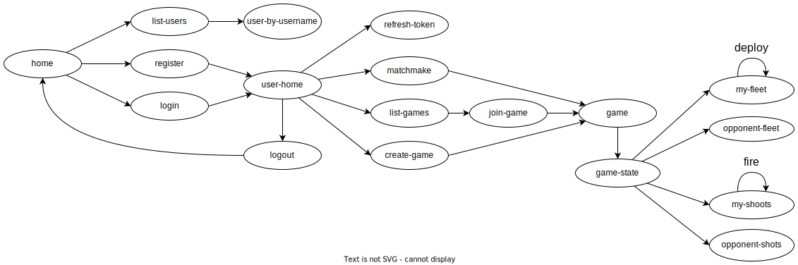

# Battleships API Documentation

> This document contains the HTTP API documentation required for a frontend client application to use this API.

> **Note**: This documentation does not contain any information about the internal backend implementation. To learn more
> about the backend implementation, please refer to the [backend documentation](../code/jvm/README.md).

## Table of Contents

* [Introduction](#introduction)
* [Journey](#journey)
* [Media Types](#media-types)
* [Authentication](#authentication)
* [Game](#game)
* [Player](#player)

---

## Introduction

This API is a RESTful API that is designed to be consumed by a frontend client application.
The API provides the following functionality:

* User authentication (see [Authentication](#authentication));
* Game creation, listing, joining, leaving and matchmaking (see [Game](#game));
* In-game actions, such as placing ships and firing shots (see [Player](#player)).

The Open-API specification for this API can be found [here](../docs/battleships-api-spec.yaml).

In our specification, we highlight the following aspects:

* The requests are split into four groups:
    * `Home` - contains the request to get the API's home page;
    * `User` - requests related to the `User` entity;
    * `Game` - requests related to the `Game` entity;
    * `Player` - requests related to the `Player` entity, which is a weak entity of the `Game` and `User` entities;
* All the `GET` requests are don´t need authentication, except for the ones in the `Player` group, since they are
  related to a specific player;
* All the `POST` requests (except for the user creation request) need authentication, using the `Authorization` header
  with the `Bearer` scheme.

---

## Journey

The **API journey** is as represented in the following diagram:

    

We highlight the following aspects of the API journey:

* The `home` request is the first request that the client application should make to the API. This request returns the
  API's home page, which contains the links to the other requests;
* The operations/resources that require authentication are only available to authenticated users. The authentication
  process is described in the [Authentication](#authentication) section.

---

## Media Types

The API uses the following media types:

* `application/vnd.siren+json` - [Siren](https://github.com/kevinswiber/siren) hypermedia format for the API responses;
* `application/problem+json` - [RFC7807](https://tools.ietf.org/html/rfc7807) problem details for the API responses in
  case of errors;
* `application/json` - JSON for the API request bodies.

---

## Authentication

The API uses [JSON Web Tokens](https://jwt.io/) for authentication.

### User Creation

1. The client application makes a `POST` request to the `register` request, with the user's credentials in the request
   body. The request body should be a JSON object with the following properties:
    * `username` - the user's username;
    * `email` - the user's email;
    * `password` - the user's password;
2. The API creates a new user with the provided credentials and returns a `201 Created` response with the user's tokens
   in the response body. The response body should be a JSON object with the following properties:
    * `accessToken` - the user's access token - this token should be used in the `Authorization` header with
      the `Bearer` scheme for all the requests that require authentication;
    * `refreshToken` - the user's refresh token - this token should be sent in the request body of the `refresh-token`
      request to get a new access token;
3. The client application should store the user's tokens in a secure place, such as the user's browser's local storage.

### User Login

1. The client application makes a `POST` request to the `login` request, with the user's credentials in the request
   body. The request body should be a JSON object with the following properties:
    * `username` - the user's username;
    * `password` - the user's password;
2. The API authenticates the user and returns a `200 OK` response with the user's tokens in the response body, like in
   the [User Creation](#user-creation) section.

### Refresh Token

1. If the user's access token expires, the client application should make a `POST` request to the `refresh-token`
   request, with the user's refresh token in the request body. The request body should be a JSON object with the
   following properties:
    * `refreshToken` - the user's refresh token;
2. The API authenticates the user and returns a `200 OK` response with the user's new tokens in the response body, like
   in the [User Creation](#user-creation) section.

---

## Game

The API provides the following operations/resources related to the `Game` entity:

* `create-game` - creates a new game;
* `list-games` - lists all the games;
* `join-game` - joins a game;
* `leave-game` - leaves a game;
* `matchmake` - matchmakes the user with another user.
* `get-game` - gets a game;
* `get-game-state` - gets the game's state.

---

## Player

The API provides the following operations/resources related to the `Player` entity:

* `deply-fleet` - deploys the player's fleet;
* `get-fleet` - gets the player's fleet;
* `get-opponent-fleet` - gets the opponent's fleet;
* `fire-shot` - fires a shot;
* `get-shots` - gets the player's shots;
* `get-opponent-shots` - gets the opponent's shots.
